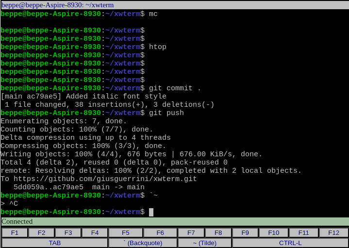
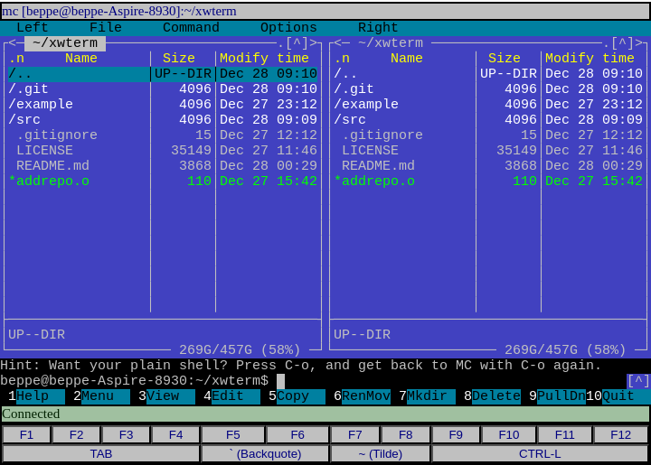
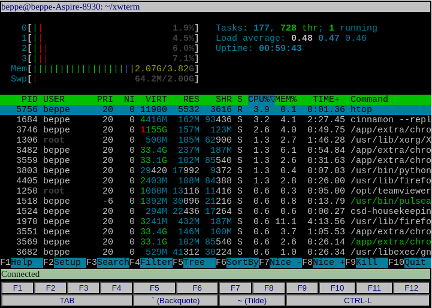
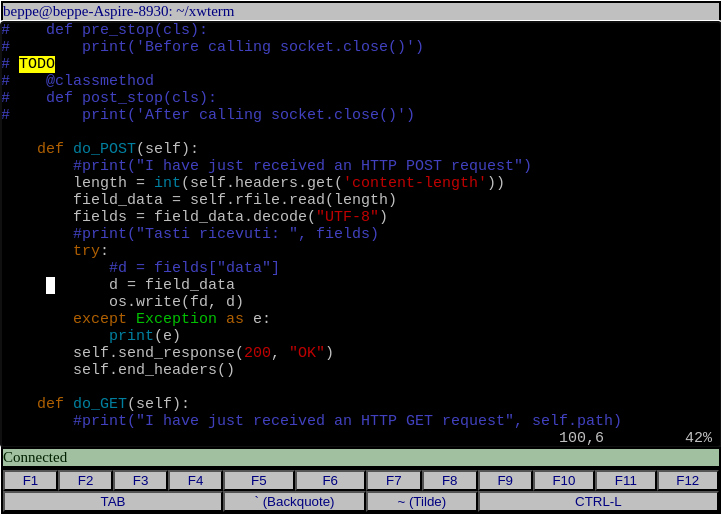

# xwterm
**Simple web Xterm and ANSI terminal emulator - pure JavaScript, no dependencies**   

## Table of Contents
- [Introduction](#introduction)
- [Setup](#setup)
- [Usage](#usage)
- [Sample server](#sample-server)
- [About scrollbar](#about-scrollbar)
- [Full documentation](#full-documentation)
- [Live example](#live-example)
- [Screenshots](#screenshots)
- [Caveats](#caveats)
- [TODO](#todo)
- [Enjoy](#enjoy)

## Introduction
The goal of this project is to provide a simple, pure javascript terminal emulator frontend
(i.e., the client side). Connecting to a terminal service is a user's responsibility.
For testing purposes, a very basic terminal server is available here.

This project is still under development.

## Setup
The source is a single JavaScript file (**src/xwterm.js**); once downloaded (e.g.,
by cloning the repository), it is ready to use. To produce a minified version,
run **make** from the project's root directory. **[terser](https://terser.org/)** is
required to do this. The minified file is **dist/xwterm.min.js**. You can also download
the minified file directly from the [GitHub releases page](https://github.com/giusguerrini/xwterm/releases).
**It is recommended to use release versions, unless your goal is to contribute to this project,
as the latest commit may contain experimental or incomplete code.**

## Usage
The following HTML code shows a minimal example of use. It generates a page containing
only a terminal with default properties:

	<html lang="en">
	  <head>
	    <meta charset="UTF-8">
	    <meta name="viewport" content="width=device-width, initial-scale=1.0">
	  </head>
	  <body>
	  </body>
	  
	</html>

The only thing the programmer has to do is to create an instance of the `AnsiTerm` class.
You can find a more detailed explanation here: [Basic example](https://giusguerrini.github.io/xwterm/tutorial-10-basic-page.html).

By default, AnsiTerm's constructor connects its main "div" container to the document body,
but you can put a terminal inside a container of your choice by specifying its ID:

	...
	

	...
	    var ansi = new AnsiTerm("myterminal");

The constructor also accepts some configuration parameters, which you can pass as an
array of key/value pairs. The most important keys are:

- `nLines` : number of text lines (default 25)
- `nColumns` : number of characters in a line (default 80)
- `containerId` : the ID of the container where you want the terminal to be placed (default "", which
means that the constructor will use the document's body)
- `channelType` : the type of channel by which the terminal gets the stream of characters
to display and sends events. "http" (alias "rest", default), "websocket", "dummy" or "custom"
are recognized (see below for details).

Example:

	    var ansi = new AnsiTerm( { nLines: 40, nColumns: 120, containerId: "myterminal" } );

The terminal can use these kinds of channels to communicate with the server
(*NOTE: Here we use the term "server" in an extensive sense, to indicate any form of data source and destination that is suitable to be managed by a terminal.*)

- HTTP
- WebSocket
- Dummy
- Custom protocol

A detailed description of channels is here: [Communication drivers](https://giusguerrini.github.io/xwterm/tutorial-40-communication-drivers.html)

## Sample server
For testing purposes, you can find a minimal terminal server written in Python3 in the
`example` folder.

**Do not use the example as if it were a real terminal server**; it
is meant only to familiarize yourself with the AnsiTerm class and ease its development.

The server implements both HTTP and WebSocket services on TCP port 8000 and 8001
respectively. By default, the server accepts local connections only

A detailed description of the server is here: [Sample server](https://giusguerrini.github.io/xwterm/tutorial-90-sample-server.html)

## About scrollbar
The terminal implements a history buffer whose size is configurable (default: 1000 lines). To navigate through the history, a scrollbar is provided.
**AnsiTerm** utilizes the standard scrollbar widget provided by the platform, which may vary in appearance depending on the browser and system configuration.
Although in the majority of cases this is satisfactory, there might be situations where a fixed layout is necessary, irrespective of the platform.
For such cases, an implementation of a custom scrollbar is given in the additional source **src/scrollbar.js**, designed to ensure
a consistent appearance across platforms. **AnsiTerm** (i.e., **xwterm.js**) looks for a public definition of **GenericScrollBarAdder**
class, which is the main class exported by **scrollbar.js** module. If the class is not available, **AnsiTerm** defaults to an internal
implementation that uses the plain, platform-provided scrollbar. So, to enable the custom scrollbar, it is enough to import
**scollbar.js** before **xterm.js**:

	<html lang="en">
	  ...
	  
	  ...
	</html>

## Full documentation
A (still incomplete) documentation of the package, mainly classes and their methods, is here:
[API Documentation](https://giusguerrini.github.io/xwterm/index.html)

## Live example
You can test a working example of xwterm here:
[Simple JavaScript Console](https://giusguerrini.github.io/xwterm/jsconsole.html), where an instance of AnsiTerm hosts a basic JavaScript console.

## Screenshots
Here are some images taken while running the shell and some applications that require
full support of graphics functions (Midnight Commander, htop, vim):

## Caveats
Please remember that this project is in its early stage.
The project was born out of a specific need of mine in a controlled environment; to make it
fully usable, a certain effort of generalization is still required.

As the project grows, some details in the public interface (e.g., parameter names) may change.
This may happen at least until the first "non-beta" release (v1.0.0) is published.

Development and test have been done mainly on recent versions of Chrome and Firefox.
Safari has been tested very superficially. No other browsers have been tested at this time.

About Safari, there is at least a known problem: iOS soft keyboard doesn't appear if
the page doesn't contain an input field. AnsiTerm's canvas is not considered an input field
by Safari, that's why I had to add a simple hand-made soft keyboard. This problem
sometimes appears on Android devices too.

Internationalization, and encoding in general, is also an issue I neglected. My daily
environment is Western Europe (Italy), where "latin1" or "Windows-1252" are sufficient.
More sophisticated encodings are expected to be problematic.

## TODO
Many things to do:
- Clean up code and add comments.
- Add better support for server-side sessions (e.g., cookies, access tokens...)
- Add support for hyperlinks and hyperlink sequences (e.g, `\e]8;;http://example.com\e\\This is a link\e]8;;\e`)
- Add custom CSS properties to configure the terminal. Currently, the configuration comes
  from a set of parameters passed to the constructor.
- Add a configuration item to choose the terminal mode (e.g., "pure ANSI", "xterm", "xterm-256"...).
- Improve the soft keyboard. The current implementation reflects my particular need: Italian 
  keyboards don't have "Tilde" nor "Backquote" keys...
- Add management of alternate character set (see "G0/G1" character set selection sequences).
- Add a history buffer (and a scroll bar, of course).
- Implement resizing and responsiveness. This means the terminal should maintain logical lines as generated by the server
  (i.e., the sequences of characters ending with a line feed), because when the number of columns changes, it is expected
  that logical lines are preserved instead of being truncated to the previous visual line length.

## Enjoy!

